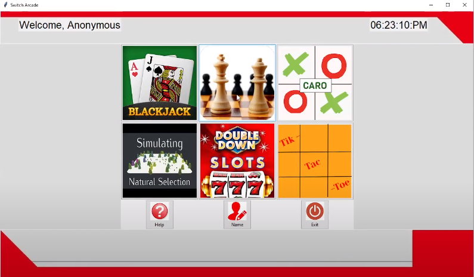

A Python-based Switch Arcade Game was designed including six mini arcade games with distinct features and gameplay mechanics.

<!-- citation and icon code -->

 
<a href="https://youtu.be/SRjhR7N2S8I">Demo:  <i class="fas fa-fw fa-link zoom" aria-hidden="true"></i></a>

 