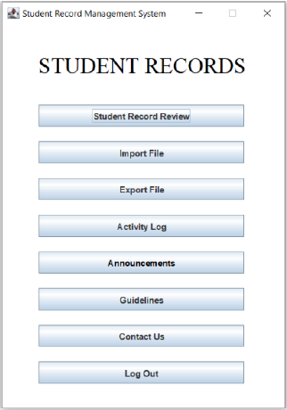
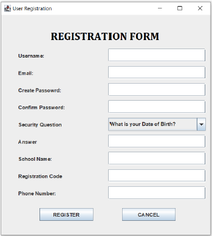
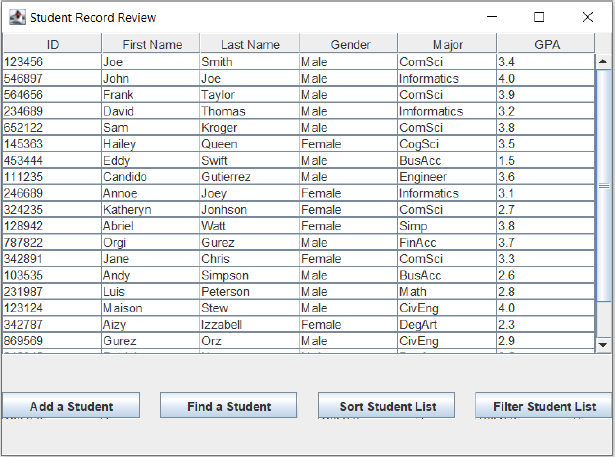
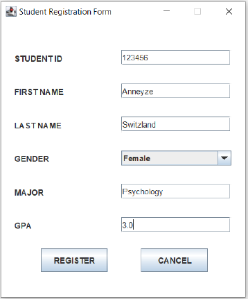

In a collaborative effort with a four-person team, fundamental Agile methodologies guided the development of a streamlined student records database application aimed at intuitive data access and management. Leveraging Java and the BlueJ interface, a Java GUI was constructed to serve as the front-end, complementing a meticulously developed back-end complete with unit tests. This approach ensured optimized database interactions, resulting in an efficient and user-friendly student records management system tailored for educators and administrators.

<!-- citation and icon code -->

 
<a href="https://youtu.be/yiijX7eUbU4">Demo:  <i class="fab fa-fw fa-youtube-square zoom" aria-hidden="true"></i></a>   
<a href="https://github.com/ahvuong/Student_Record_Management_System_App">Github: <i class="fab fa-fw fa-github zoom" aria-hidden="true"></i></a>   

  

  

  

  

  