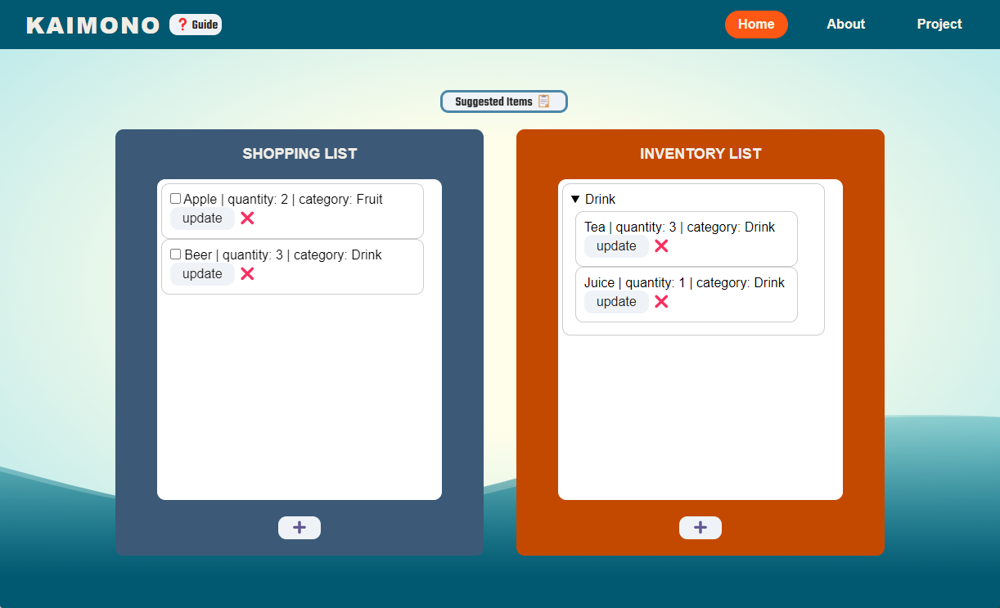
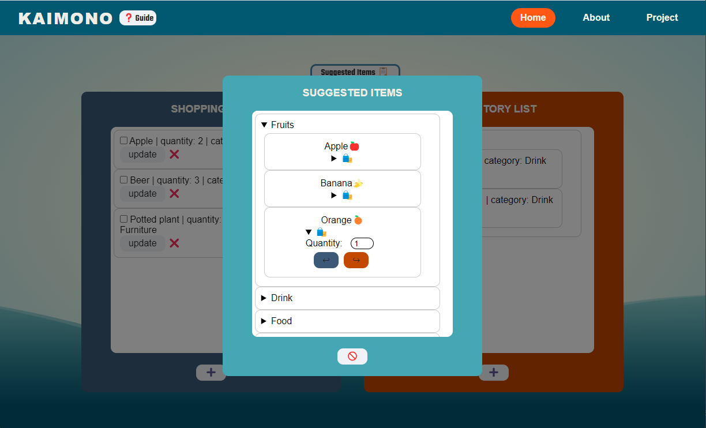

In collaboration with a 10-member Agile team, daily stand-ups, Github, and Trello boards were coordinated to oversee the development of a smart inventory management web application. Responsive user interfaces for inventory and shopping list features were crafted using HTML, CSS, and JavaScript, ensuring compatibility across desktop and mobile browsers. The implementation of CI/CD practices, along with automated front-end and back-end testing, facilitated seamless Node.js and database integration, resulting in a smart shopping web application that optimizes inventory and shopping list management.

<!-- citation and icon code -->

 
<a href="https://cse110-fa22-group22.github.io/cse110-fa22-group22/source/html/home.html">Demo:  <i class="fas fa-fw fa-link zoom" aria-hidden="true"></i></a>   
<a href="https://github.com/ahvuong/cse110-fa22-group22">Github: <i class="fab fa-fw fa-github zoom" aria-hidden="true"></i></a>

  

  

