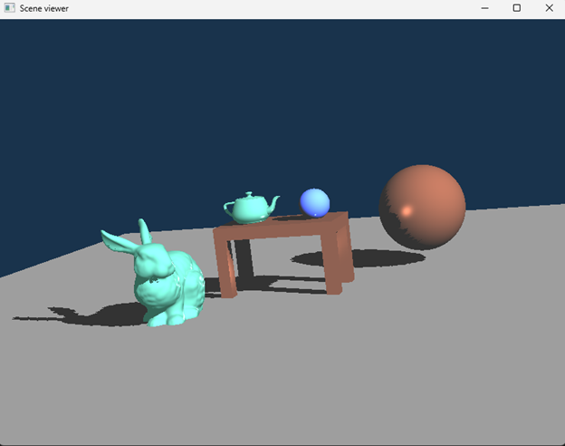
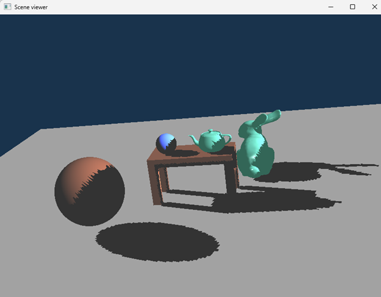

Shadow mapping is a technique used to enhance the realism and depth perception in 3D scenes by adding shadows. It involves creating shadows in a scene by determining the depth of objects from a light source's perspective during the rendering process. The implementation of this lighting technique and code structure is rooted in C++ and is built upon the foundational structure of the shadow map algorithm as provided by OpenGL tutorials. This project was a collaborative effort, completed by a team of two members.

<!-- citation and icon code -->

 
<a href="https://youtu.be/Vy1LIluXdNc">Demo:  <i class="fas fa-fw fa-link zoom" aria-hidden="true"></i></a>   
<a href="https://github.com/ahvuong/Student_Record_Management_System_App">Github: <i class="fab fa-fw fa-github zoom" aria-hidden="true"></i></a>

  

