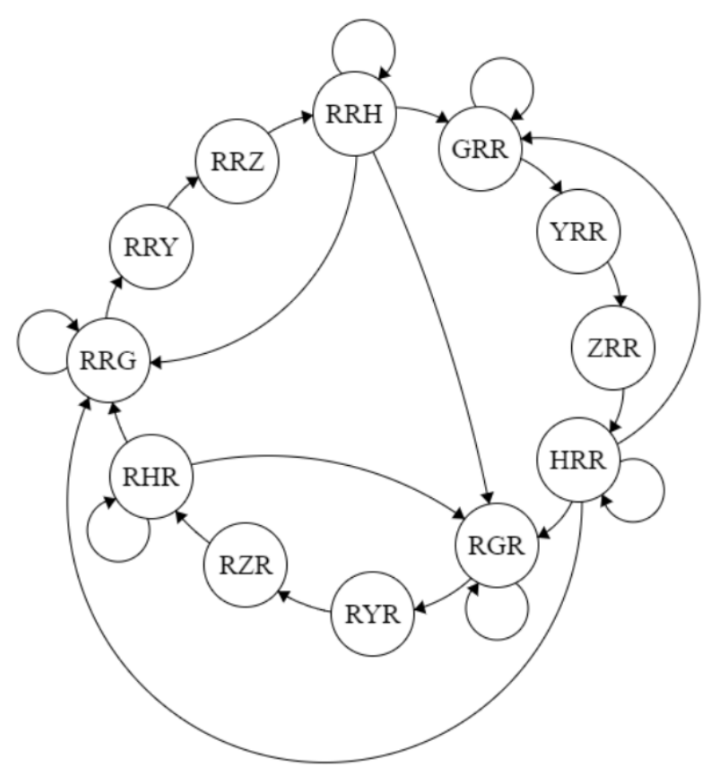
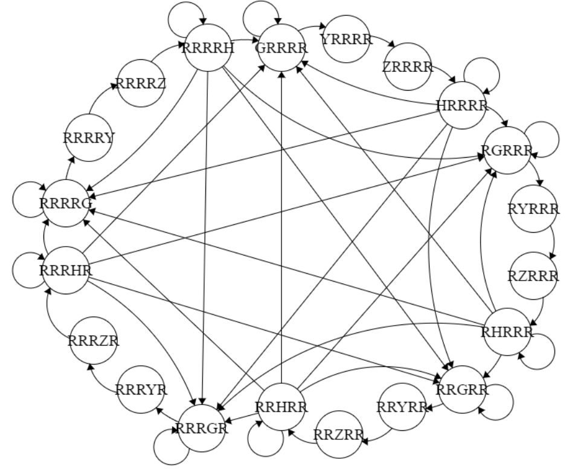
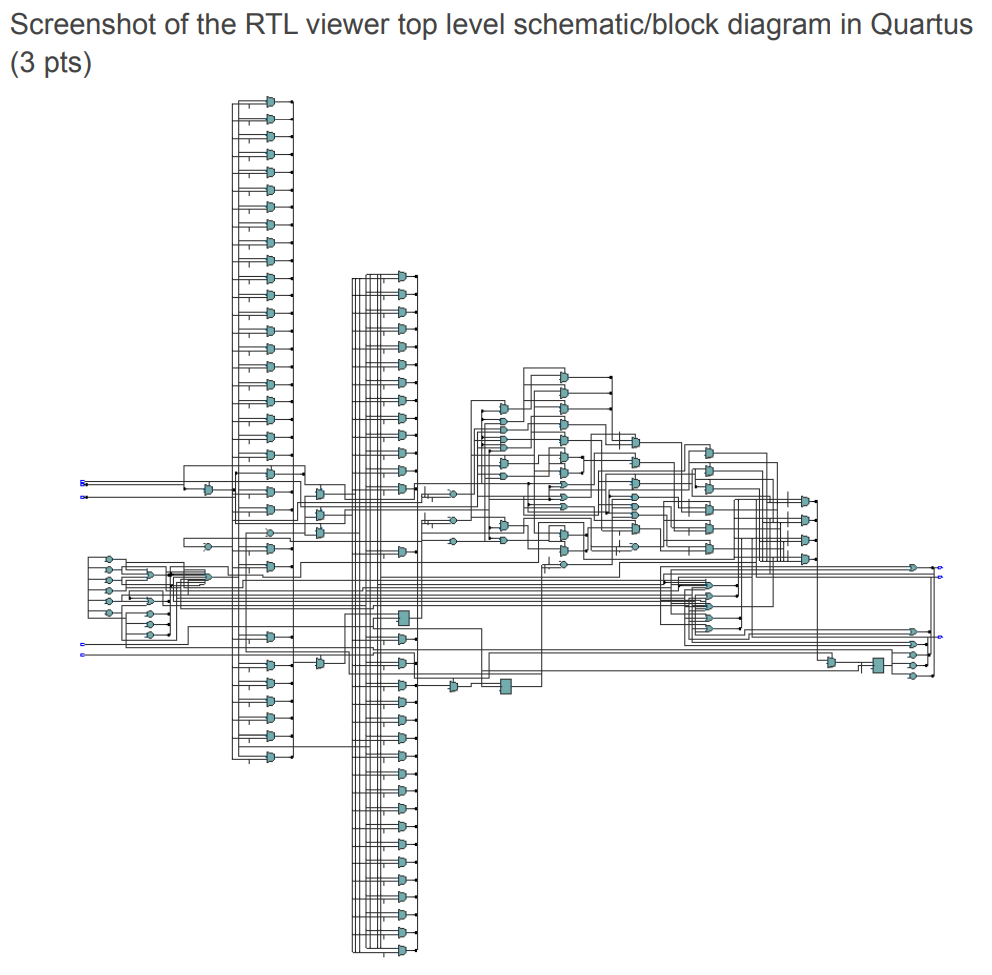
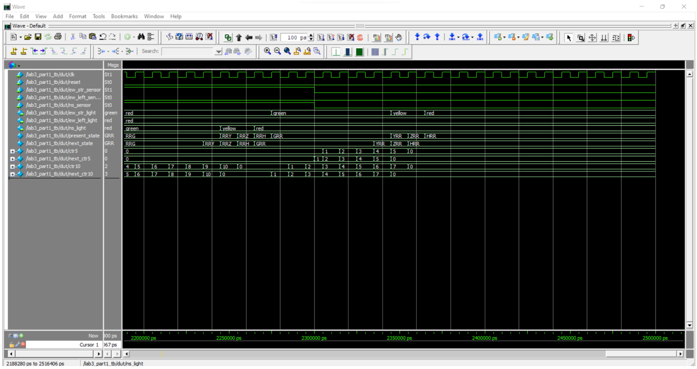
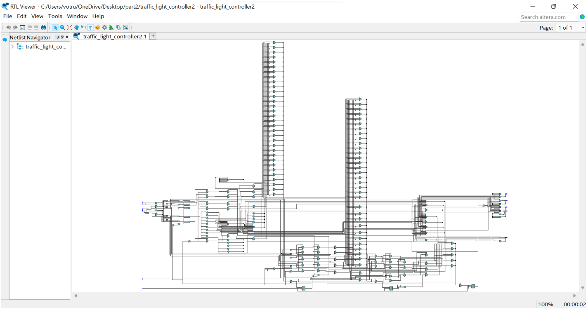
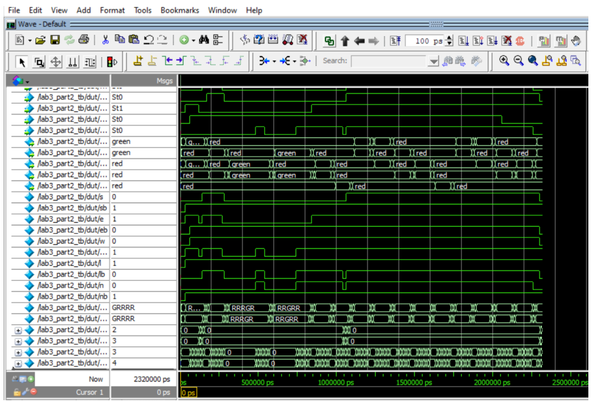

* Designed and implemented a Verilog-based state machine to control a four-way traffic system, applying logic design, FPGA-style development, and digital circuit modeling to manage timing, sequencing, and safe operations.
* Built and validated the system using simulation tools and test benches, performing waveform analysis to verify signal transitions and reliability, demonstrating skills in digital design, testing methodologies, and hardware verification.

<!-- citation and icon code -->

 
<!--
<a href="https://cse110-fa22-group22.github.io/cse110-fa22-group22/source/html/home.html">Demo:  <i class="fas fa-fw fa-link zoom" aria-hidden="true"></i></a>   -->
<a href="https://github.com/ahvuong/Traffic-Signal-Controller">Github: <i class="fab fa-fw fa-github zoom" aria-hidden="true"></i></a>

  

  

