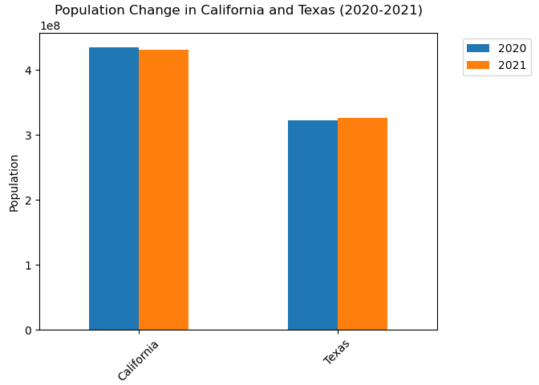
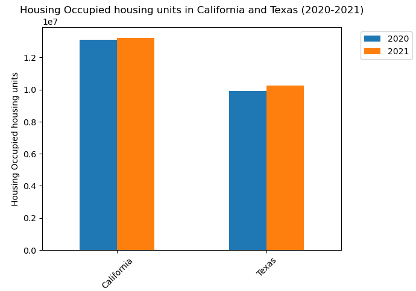

Within a team consisting of four members, an Exploratory Data Analysis (EDA) study was carried out to investigate the correlation between housing prices and population shifts in California and Texas. This involved cleaning the data, discovering patterns, and hypothesizing formulas using Python, Jupyter Notebook, Sklearn, Seaborn, Pandas, and NumPy. Additionally, the study encompassed a correlation analysis to assess the influence of housing costs on interstate migration flows in these two states.

<!-- citation and icon code -->

 
<a href="https://github.com/ahvuong/Data-Driven-Population-Analysis-in-California/blob/master/FinalProjectGroup_Sp23_AAA-H.ipynb">Demo:  <i class="fas fa-fw fa-link zoom" aria-hidden="true"></i></a>   
<a href="https://github.com/ahvuong/Data-Driven-Population-Analysis-in-California">Github: <i class="fab fa-fw fa-github zoom" aria-hidden="true"></i></a>

  

