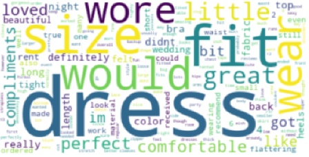

Heading a collaborative development project.

<!-- citation and icon code -->

 
<a href="https://github.com/ahvuong/Predictive_Analysis_of_User_Ratings/blob/main/CSE158RFA23_Assignment2_Report.pdf">Demo:  <i class="fab fa fa-file-pdf-o" aria-hidden="true"></i></a>   
<a href="https://github.com/ahvuong/Predictive_Analysis_of_User_Ratings">Github: <i class="fab fa-fw fa-github zoom" aria-hidden="true"></i></a>

