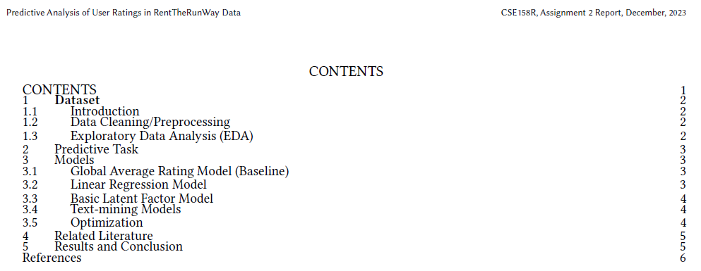

This collaborative predictive analysis project involves the combined efforts of a team of four individuals. Centered around RentTheRunway's Clothing Fit Data, our group utilizes Python, Jupyter Notebooks, and diverse libraries like Numpy, Scikit-learn, and Tensorflow. The project encompasses dataset introduction, cleaning, and exploratory analysis, with a specific focus on predictive models, text-mining techniques, and optimization strategies. Through this comprehensive approach, our team aims to deepen our understanding of factors influencing customer satisfaction in the online fashion sector, ultimately culminating in predictions facilitated by a recommender system.

<!-- citation and icon code -->

 
<a href="https://github.com/ahvuong/Predictive_Analysis_of_User_Ratings/blob/main/CSE158RFA23_Assignment2_Report.pdf">Report:  <i class="fas fa-file-pdf" aria-hidden="true"></i></a>   
<a href="https://github.com/ahvuong/Predictive_Analysis_of_User_Ratings">Github: <i class="fab fa-fw fa-github zoom" aria-hidden="true"></i></a>

