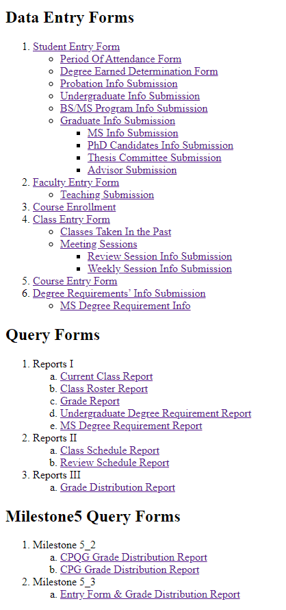

Built a responsive personal portfolio website using Jekyll, HTML, and CSS to showcase projects and technical skills. The site features a clean design, customizable layouts, and interactive elements, optimized for performance and cross-device compatibility, and deployed on GitHub Pages for seamless version control and hosting.

<!-- citation and icon code -->

 
<a href="https://ahvuong.github.io/">Demo:  <i class="fa fa-external-link" style="font-size:36px" aria-hidden="true"></i></a>   

<!--
 
-->
